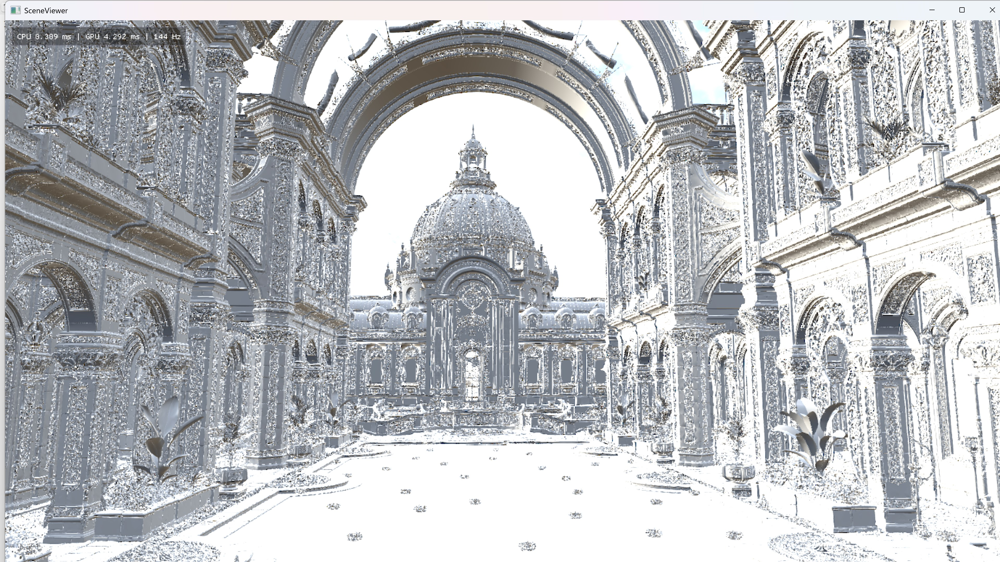
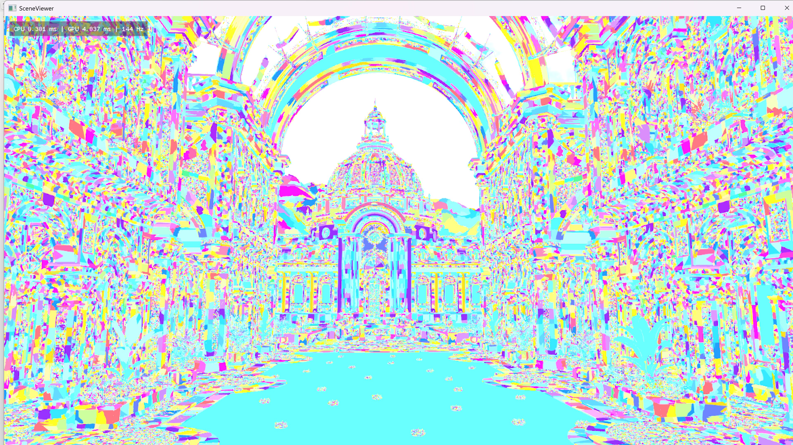
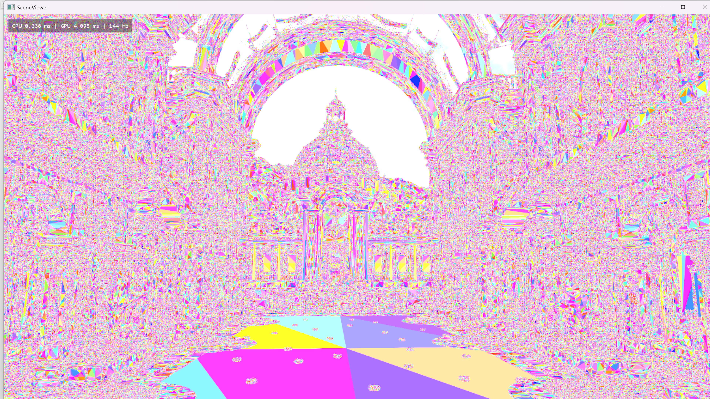

# Nyx

**Nanite-style Virtualized Geometry Renderer on DirectX 12 (MiniEngine-based)**

Nyx is a learning- and research-driven personal rendering project dedicated to studying extreme-scale geometry rendering techniques, such as continuous LOD, GPU-driven culling, mesh-shader dispatch, and demand-driven geometry streaming.

It serves as a hands-on experimental platform built on Microsoft MiniEngine and is currently validated with a mega scene [Zorah](http://developer.download.nvidia.com/ProGraphics/nvpro-samples/zorah_main_public.gltf.7z)(from Nvidia) containing:

- **1,639,668,228 unique triangles**
- **18,949,504,889 instanced triangles**

## Jump To

- [Showcase](#showcase)
- [Core Features](#core-features)
- [Architecture](#architecture)
- [Build and Run](#build-and-run)

## Showcase

- All benchmarks were performed on a system featuring an i7-14700KF and an RTX 4070 Ti Super at 4K rendering resolution.

- Demo video: 

- []
  (https://www.youtube.com/watch?v=qyV6u7DOglQ)

- Screen Shot:

  

  

  

  

## Core Features

- Nanite-style meshlet hierarchy with DAG/BVH traversal
- GPU-driven rendering with indirect `DispatchMesh`
- Two-pass frustum + HZB occlusion culling
- Visibility buffer path + resolve to deferred GBuffer
- Dynamic geometry streaming with residency table updates
- Async IO worker + LZ4-compressed geometry pages
- Runtime ImGui controls:
  - pixel error threshold
  - freeze culling
  - debug visualization modes

## Architecture

### Offline / First-load Build

When loading `.gltf` / `.glb`, Nyx can build a cached `.mini`:

1. Parse scene/material/camera/animation data.
2. Build meshlets and group them.
3. Simplify groups iteratively to generate multi-level LOD.
4. Build hierarchy nodes and metadata.
5. Pack geometry into pages.
6. Compress pages with LZ4.
7. Save metadata + blob into `.mini`.

### Runtime Frame Flow

1. Instance cull pass
2. DAG/hierarchy cull pass (frustum + HZB)
3. Build indirect mesh dispatch args
4. Mesh shader pass 0
5. Export depth + generate HZB
6. Repeat cull + mesh shader pass 1
7. Resolve visibility buffer to GBuffer
8. Deferred lighting + post

### Streaming Runtime

- Page size: **256 KB**
- Chunk size: **256 MB**
- GPU request mask readback + async page load
- LZ4 decompress + upload + address table sync
- Dynamic chunk growth for VRAM pool

## Technical Snapshot

- Language: **C++20**
- Graphics API: **DirectX 12**
- Shader Model: **6.6**
- Agility SDK package: `Microsoft.Direct3D.D3D12 1.616.1`
- Meshlet defaults:
  - Max vertices: **128**
  - Max triangles: **128**
  - Meshlet group size: **32**
  - BVH node children: **8**
- Max streaming requests/update: **16384**

## Build and Run

### Requirements

- Windows 10/11
- Visual Studio 2022
- DX12-capable GPU with Mesh Shader support
- NuGet package restore enabled

Recommended for mega scenes:

- High VRAM GPU
- 32 GB+ RAM
- NVMe SSD
- Large free disk space

### Steps

1. Open `MiniEngine/SceneViewer/SceneViewer.sln`
2. Select `Release | x64`
3. Build and run `SceneViewer`

## Command Line Examples

Open power shell,  cd to `MiniEngine\Build\x64\Release\Output\SceneViewer`

Load a model:

```bash
.\SceneViewer.exe -model .\Assets\bunny_v2\bunny.gltf
```

Load a model with instance count:

```
.\SceneViewer.exe -model .\Assets\bunny_v2\bunny.gltf -instances 3600
```

Force rebuild `.mini` cache:

```bash
.\SceneViewer.exe -model .\Assets\bunny_v2\bunny.gltf -rebuild 1
```

## Notes

If you would like to load your own glTF file, please place it inside the **Assets** folder and launch the program via the command line.

Note that for extremely large scenes, the build process may still be slow even with parallel construction enabled. The performance depends heavily on your hardware specifications.

If you plan to build and load the **Zorah** scene yourself, make sure your system has at least **48 GB of RAM** and a high-speed SSD.

Alternatively, you can download and use the prebuilt files I have provided:

## Controls

- `W A S D` / `Q E`: move
- Mouse: look
- Mouse wheel: camera speed scaling
- `Shift`: fine movement toggle
- `Backspace`: engine tuning/debug UI

## Repository Layout

- `MiniEngine/Core`: engine core, graphics systems, input, tuning
- `MiniEngine/Model`: model pipeline, meshlets, culling, streaming, shaders
- `MiniEngine/SceneViewer`: runtime viewer application
- `MiniEngine/SceneViewer/Assets`: sample and stress scenes

## Acknowledgements

- [Unreal Engine Nanite talks and publications](https://advances.realtimerendering.com/s2021/Karis_Nanite_SIGGRAPH_Advances_2021_final.pdf)
- [Microsoft MiniEngine](https://github.com/microsoft/DirectX-Graphics-Samples/tree/master/MiniEngine)
- [`meshoptimizer`](https://github.com/zeux/meshoptimizer)
- [`lz4`](https://github.com/lz4/lz4)
- [`cgltf`](https://github.com/jkuhlmann/cgltf)
- [`imgui`](https://github.com/ocornut/imgui)
- Inspiration references: [`nanite-webgpu`](https://github.com/Scthe/nanite-webgpu), [`vk_lod_clusters`](https://github.com/nvpro-samples/vk_lod_clusters)

## License and Asset Notice

- Nyx source code is licensed under the MIT License. See `LICENSE`.
- Third-party components keep their original licenses. See `THIRD_PARTY_NOTICES.md`.
- Scene assets may have separate licenses and usage restrictions.
- Verify asset terms before redistribution.

## Contact

- Email: `love.jingjing.forever.1314@gmail.com`


