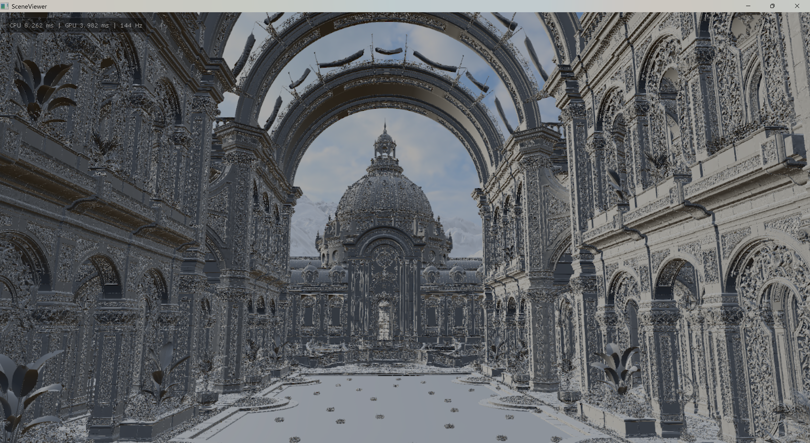
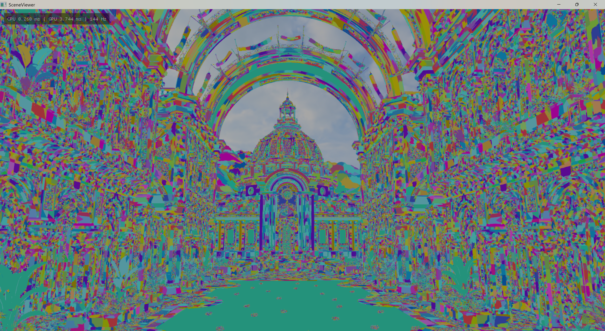
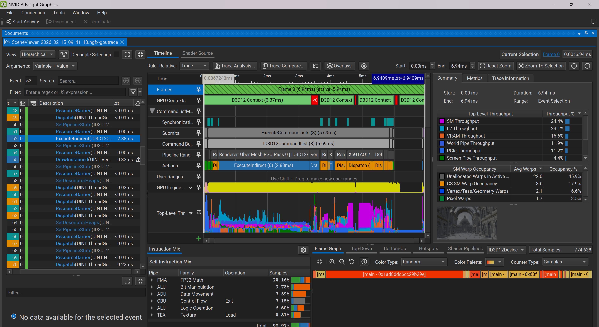

# Nanite-style virtualized geometry renderer on DirectX 12

Nanite-style virtualized geometry renderer on DirectX 12 (built on Microsoft MiniEngine).

Nyx is a personal research project focused on extreme-scale geometry rendering: continuous LOD, GPU-driven culling, mesh-shader dispatch, and demand-driven geometry streaming.

The current stress test scene is [Zorah](http://developer.download.nvidia.com/ProGraphics/nvpro-samples/zorah_main_public.gltf.7z) (NVIDIA), with:

- **1,639,668,228 unique triangles**
- **18,949,504,889 instanced triangles**

## Showcase

Test platform for the screenshots/video below: **i7-14700KF + RTX 4070 Ti SUPER**, rendered at **4K**.

Demo video:

<p align="center">
  <a href="https://www.youtube.com/watch?v=qyV6u7DOglQ&t=9s">
    
  </a>
</p>


> 18.9G triangles, Nanite-style pipeline, GPU-driven culling, mesh shader rendering, real-time streaming

Screenshots:

<p align="center">Lit mode</p>


<p align="center">Meshlet mode</p>




<p align="center">Triangle mode</p>




## Core Features

- Nanite-style meshlet hierarchy with DAG/BVH traversal
- GPU-driven rendering via indirect `DispatchMesh`
- Two-pass frustum + HZB occlusion culling
- Visibility buffer pipeline, then resolve to deferred GBuffer
- Dynamic geometry streaming with residency/address table updates
- Async page IO + LZ4-compressed geometry pages
- Runtime debug/tuning UI (pixel error, culling freeze, debug modes)

## Quick Start

### Requirements

- Windows 10/11
- Visual Studio 2022
- DX12 GPU with Mesh Shader support
- NuGet package restore enabled

Recommended for large scenes:

- High-VRAM GPU
- 32 GB+ RAM (48 GB+ recommended for rebuilding very large assets)
- NVMe SSD
- Large free disk space

### Build

1. Open `MiniEngine/SceneViewer/SceneViewer.sln`
2. Select `Release | x64`
3. Build and run `SceneViewer`

By default, SceneViewer loads:

- `Assets/bunny/bunny.gltf`

### Zorah Quick Start (Prebuilt Cache)

Building Zorah cache locally can be time-consuming and memory-intensive.
If you only want to run the demo, use the prebuilt files:

- [Download prebuilt Zorah package](https://pan.quark.cn/s/28de91939fee)

After download, extract/copy the files to:

`MiniEngine/SceneViewer/Assets/zorah_main_public/`

Then run:

```powershell
.\SceneViewer.exe -model .\Assets\zorah_main_public\zorah_main_public.gltf
```

## Command Line

From the SceneViewer output directory, examples:

Typical path (default MiniEngine layout):

`MiniEngine\Build\x64\Release\Output\SceneViewer\`

```powershell
.\SceneViewer.exe -model .\Assets\bunny\bunny.gltf
.\SceneViewer.exe -model .\Assets\Jinx\scene.gltf -instances 3600
.\SceneViewer.exe -model .\Assets\bunny\bunny.gltf -rebuild 1
```

Arguments:

- `-model <path>`: glTF/glb scene path
- `-instances <N>`: instance count (clamped to `1..1000000`)
- `-rebuild 1`: force rebuild `.mini` cache

## Controls

- `W A S D` / `Q E`: move
- Mouse: look
- Mouse wheel: movement speed scale
- `Shift`: fine movement toggle
- `Backspace`: engine tuning/debug UI

## Architecture Overview

### Offline / First-load Build (`.gltf/.glb` -> `.mini`)

1. Parse scene/material/camera/animation data
2. Build meshlets and meshlet groups
3. Iteratively simplify groups for multi-level LOD
4. Build hierarchy nodes and metadata
5. Pack geometry pages
6. Compress pages with LZ4
7. Save metadata + blob to `.mini`

### Runtime Frame Flow

1. Instance culling
2. DAG/hierarchy culling (frustum + HZB)
3. Build indirect mesh dispatch args
4. Mesh shader pass 0
5. Export depth and generate HZB
6. Repeat cull + mesh shader pass 1
7. Resolve visibility buffer to GBuffer
8. Deferred lighting + post effects

### Streaming Runtime

- Page size: **256 KB**
- Chunk size: **256 MB**
- Max streaming requests/update: **16384**
- GPU request mask readback + async page load + LZ4 decompress + upload

## Technical Snapshot

- Language: **C++20**
- Graphics API: **DirectX 12**
- Shader Model: **6.6**
- Agility SDK package: `Microsoft.Direct3D.D3D12 1.616.1`
- Meshlet defaults: max vertices **128**, max triangles **128**, group size **32**, BVH node children **8**

## Repository Layout

- `MiniEngine/Core`: engine core and rendering systems
- `MiniEngine/Model`: model conversion, meshlets, culling, streaming, shaders
- `MiniEngine/SceneViewer`: runtime app
- `MiniEngine/SceneViewer/Assets`: sample and stress scenes

## Notes

- To load custom glTF assets, place them under `MiniEngine/SceneViewer/Assets` and pass the path with `-model`.
- This project uses MiniEngine conventions (right-handed coordinate handling inside the renderer path).
- Large-scene build time depends heavily on CPU, storage bandwidth, and available memory.

## Acknowledgements

- [Unreal Engine Nanite talks and publications](https://advances.realtimerendering.com/s2021/Karis_Nanite_SIGGRAPH_Advances_2021_final.pdf)
- [Microsoft MiniEngine](https://github.com/microsoft/DirectX-Graphics-Samples/tree/master/MiniEngine)
- [`meshoptimizer`](https://github.com/zeux/meshoptimizer)
- [`lz4`](https://github.com/lz4/lz4)
- [`cgltf`](https://github.com/jkuhlmann/cgltf)
- [`imgui`](https://github.com/ocornut/imgui)
- Inspiration references: [`nanite-webgpu`](https://github.com/Scthe/nanite-webgpu), [`vk_lod_clusters`](https://github.com/nvpro-samples/vk_lod_clusters)

## License

- Nyx source code: MIT License (`LICENSE`)
- Third-party components: original licenses (`THIRD_PARTY_NOTICES.md`)
- Scene assets may have separate licenses and restrictions; verify before redistribution

## Contact

- `love.jingjing.forever.1314@gmail.com`


